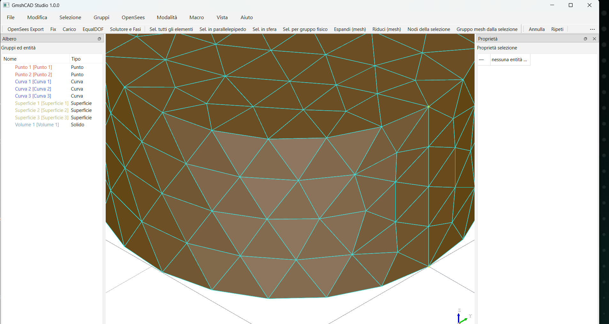

 </br>

# GmshCAD Studio - *Son Of Batch*

Ambiente CAD 3D generato totalmente con AI basato su **OpenCASCADE** (pythonocc-core) con integrazione
completa di **Gmsh**: import di mesh `.msh`, selezione e raggruppamento
entità, modellazione B-Rep di punti/curve/superfici/solidi e meshing embedded.

## Caratteristiche

### Modalità Mesh — lettura modelli `.msh` (Gmsh)
- Import dei formati **MSH 2.2 e 4.1 ASCII** (parser integrato) e **binari**
  tramite l'API gmsh (`gcs.core.gmsh_bridge.import_msh_gmsh`).
- Ogni blocco entità Gmsh (punto / curva / superficie / volume) diventa
  un'entità del documento, con nome del gruppo fisico e marker.
- **Selezione completa**: per tipo, per nome (wildcard/regex), per gruppo,
  per tag fisico, per colore, in parallelepipedo, in sfera, semi-spazio,
  N più vicine, per dimensione (area/lunghezza/volume), superfici piane/curve,
  per direzione della normale, più piccole/grandi, espandi/riduci (grow/shrink),
  componente connessa, sotto-entità (punti/curve/superfici di una selezione),
  bordo delle superfici. Selezione anche a livello di **elementi/nodi mesh**.
- **Gruppi**: creazione dalla selezione, gruppi automatici (superfici piane,
  curve, per tag fisico), gruppi di elementi/nodi mesh, rinomina/elimina,
  export testuale, mapping su gruppi fisici all'export `.msh`.

### Modalità Geometria — creazione di modelli da meshare
- **Creazione**: punti, linee, polilinee, spline (punti di controllo
  editabili), cerchi, archi, superfici da poligono/profilo/rigata,
  rettangoli, box, cilindri, sfere, coni, tori, estrusione, rivoluzione,
  loft, sweep.
- **Modifica ed editing**: trasla/ruota/scala/specchia, booleane (fusione,
  taglio, intersezione), raccordo e smusso, svuotamento (cavity), offset,
  esplodi in sotto-entità, editing parametrico dei punti di controllo,
  undo/redo completo.
- **Verso Gmsh**: export STEP/IGES/BREP, template `.geo` parametrico,
  **meshing embedded** via API gmsh (File ▸ Mesha il modello) con
  riimportazione automatica del `.msh` in modalità Mesh.

### Macro e comandi personalizzati
- Cartella `gcs/macros/`: ogni file `.py` con il decorator `@macro` viene
  caricato automaticamente (anche a caldo, F5).
- Ogni macro dichiara **a quali bersagli si applica** (`punto`, `curva`,
  `superficie`, `solido`, `nodo_mesh`, `elemento_mesh`, `entita`) e i
  **propri parametri** (float/int/str/bool/choice/vec3): la GUI genera il
  dialog di inserimento automaticamente.
- Il motore applica la funzione a **ogni sotto-entità** della selezione
  corrente (es. ogni superficie di un solido, ogni nodo della zona
  selezionata), con gestione errori per bersaglio, statistiche e log.
- Risultati: sostituzione della geometria (`replace=True`), nuove entità in
  un gruppo dedicato (`create_new=True`) o effetti collaterali arbitri.
- Comandi rapidi definibili in `gcs/user_commands.py` (iniettati nella console).

## Installazione

pythonocc-core si installa più facilmente via **conda-forge**:

```bash
# con micromamba/mamba/conda
micromamba create -y -n gmshcad -c conda-forge python=3.11 pythonocc-core=7.7.2
micromamba activate gmshcad
pip install -r requirements.txt        # PySide6, gmsh, numpy, pytest
```

In alternativa usare l'ambiente pronto:

```bash
micromamba env create -y -f environment.yml
micromamba activate gmshcad
```

Verifica delle dipendenze:

```bash
python main.py --selfcheck
```

## Avvio

```bash
python main.py            # interfaccia grafica (viewer 3D AIS)
python main.py --demo     # demo end-to-end headless (senza GUI)
pytest tests/ -q          # suite di test
```

Linux: se gmsh/OpenCASCADE segnalano librerie mancanti (libGLU, libEGL),
installare `libglu1-mesa libegl1` (Debian/Ubuntu) o impostare
`LD_LIBRARY_PATH` verso una cartella locale che le contenga.

## Demo inclusa

`python main.py --demo --out output` esegue l'intero flusso:

1. **Geometria**: staffa a L con due fori e raccordi → `staffa.step` + template `staffa.geo`;
2. **Gmsh**: mesh tetraedrica embedded → `staffa.msh` (v4.1);
3. **Mesh**: reimport, selezioni per tipo/normale/sfera, grow, gruppi;
4. **Macro**: `Marca per area` sulle superfici, `Perturba nodi` sui nodi,
   `Trasla punti` su punti di costruzione;
5. **Export**: elenco gruppi `gruppi.txt` e mesh marcata `staffa_export.msh`.

Campioni pronti in `samples/`: `bracket_22.msh` e `bracket_41.msh`
(stessa staffa, formati 2.2 e 4.1, con gruppi fisici `fondazione`,
`superfici_carico`, `lato_fisso`, `struttura`). Rigenerabili con
`python samples/make_samples.py`.

## Architettura

```
gmsh-cad-studio/
├── main.py                 # entry point (GUI / --demo / --selfcheck)
├── environment.yml         # ambiente conda completo
├── requirements.txt        # dipendenze pip (dentro l'ambiente conda)
├── gcs/
│   ├── core/               # logica, indipendente dalla GUI
│   │   ├── entities.py     #   entità (punto/curva/superficie/solido/blocco mesh)
│   │   ├── mesh.py         #   modello mesh + selezione elementi/nodi
│   │   ├── msh_importer.py #   parser .msh 2.2/4.1 ASCII
│   │   ├── groups.py       #   gruppi (geometria e mesh)
│   │   ├── selectors.py    #   motore di selezione (+ query fluenti)
│   │   ├── document.py     #   documento: entità, undo/redo, import/export
│   │   ├── builder.py      #   modalità geometria: creazione
│   │   ├── editors.py      #   modalità geometria: modifica/editing
│   │   ├── macro_engine.py #   motore macro @macro + parametri
│   │   ├── occ_utils.py    #   primitive B-Rep OpenCASCADE (+ compat API)
│   │   ├── gmsh_bridge.py  #   meshing embedded, .geo, export .msh 2.2
│   │   └── demo.py         #   demo end-to-end headless
│   ├── gui/
│   │   ├── viewer.py       #   viewer 3D AIS (qtViewer3d) + fallback
│   │   ├── main_window.py  #   finestra principale, menu, toolbar, modalità
│   │   ├── panels.py       #   albero entità, proprietà, console, log, macro
│   │   └── dialogs.py      #   dialog parametri auto-generato
│   ├── macros/             # 5 macro di esempio (vedi sotto)
│   └── user_commands.py    # comandi rapidi per la console
├── samples/                # campioni .msh + script di generazione
└── tests/                  # suite pytest (31 test)
```

## Come scrivere una macro

Crea un file in `gcs/macros/` (o genera il template con
`python main.py --macro-template mia_macro.py`):

```python
from gcs.core.macro_engine import macro, P

@macro(
    nome="Offset ogni superficie",
    applies_to=("superficie",),          # bersagli: punto, curva, superficie,
                                         # solido, nodo_mesh, elemento_mesh, entita
    params=[P("offset", "float", default=1.0, min=-50, max=50,
              help="Spostamento lungo la normale [mm]")],
    category="Personalizzate",
    create_new=True,                     # il risultato diventa nuova entità
)
def run(ctx, target, params):
    """Applicata a OGNI superficie delle entità selezionate."""
    from gcs.core import occ_utils as ou
    return ou.offset_shape(target.shape, params["offset"])
```

Poi nella GUI: seleziona le entità ▸ menu Macro ▸ esegui (o pannello Macro).
I parametri dichiarati compaiono in un dialog automatico; il motore espande
la selezione nei bersagli richiesti e invoca `run` per ciascuno, segnalando
errori per-elemento senza interrompere il batch.

Contesto disponibile in `ctx`: `ctx.doc` (documento), `ctx.log(...)`,
`ctx.params`, statistiche `ctx.ok`/`ctx.errors`. Per i nodi mesh il bersaglio
espone `target.model` e `target.node_id` (modifica `model.nodes[node_id]`).

## Query fluenti (console Python)

La console integrata espone `doc`, `builder`, `editor`, `sel`, `gb`, `engine`:

```python
doc.query().type("superficie").planar().in_box(0, 0, 0, 50, 50, 50).select()
doc.query().type("face").facing(0, 0, 1, tol_deg=10).grow().select()
sel.select_by_normal(doc, 0, 0, 1, tol_deg=15)     # stile funzione
gb.mesh_step("modello.step", "modello.msh", clmax=4.0)   # meshing gmsh
```

## Limiti noti

- Il parser interno legge i formati **ASCII** 2.2/4.1; i binari passano da
  `gmsh_bridge.import_msh_gmsh()` (richiede `pip install gmsh`).
- La modifica dei vertici di solidi importati (STEP) non è topologicamente
  banale: usare trasformazioni/booleane o ricostruire la geometria.
- Per mesh molto grandi la visualizzazione dei blocchi (compound di facce)
  è pensata per taglie da pre/post-processore, non per milioni di elementi.
=======

